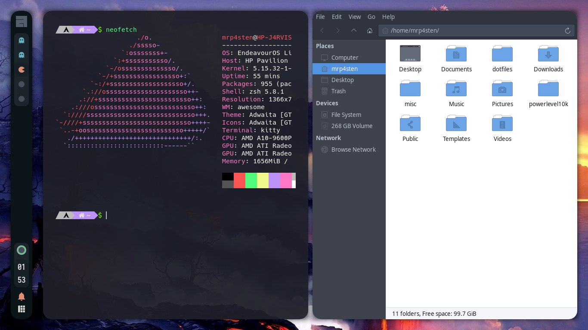
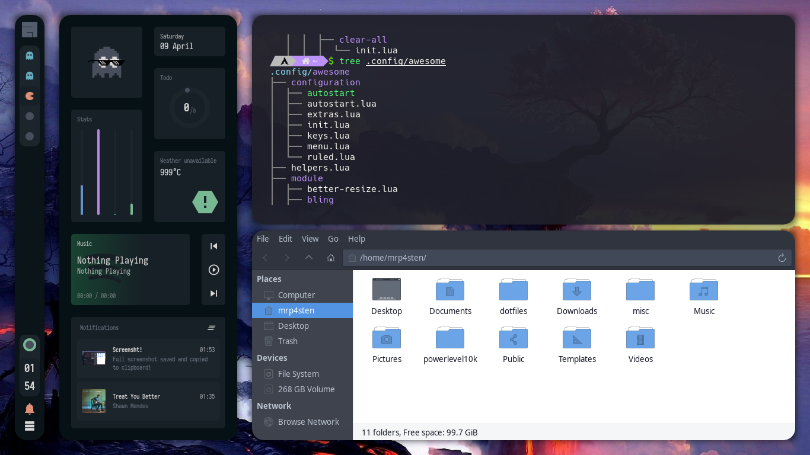
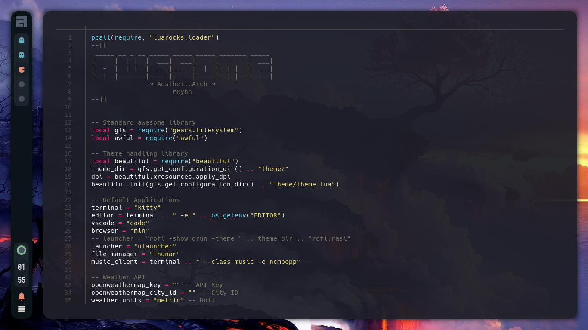

# Welcome to my personal Arch Linux workspace





# Installation/Configuration
<details>
<summary><strong>STEPS</strong></summary>

* <p>First packages</p>

```shell
sudo pacman -S git nano gedit wget
```

Install paru for AUR helper

```shell
sudo pacman -S --needed base-devel
git clone https://aur.archlinux.org/paru.git && cd paru && makepkg -si
```

* <p> Terminal </p>

Install Kitty terminal
```shell
sudo pacman -S kitty
```

Download my favorite Nerd Font
```shell
cd /usr/share/fonts
sudo wget https://github.com/ryanoasis/nerd-fonts/releases/download/v2.1.0/Hack.zip
sudo unzip Hack.zip
sudo rm Hack.zip
```

Clone my repository
```shell
git clone https://github.com/mrp4sten/dotfiles.git
```

Configuration Kitty
```shell
cp dotfiles/config/kitty ~/.config/
```

Installing zsh and plugins
```shell
sudo pacman -S zsh zsh-syntax-highlighting zsh-autosuggestions lsd bat exa mdcat

Installing oh-my-zsh
```shell
sh -c "$(wget https://raw.github.com/ohmyzsh/ohmyzsh/master/tools/install.sh -O -)"
```

Installing powerlevel10k
```shell
git clone --depth=1 https://github.com/romkatv/powerlevel10k.git ~/powerlevel10k
echo 'source ~/powerlevel10k/powerlevel10k.zsh-theme' >>~/.zshrc
```

Install fzf
```shell
git clone --depth 1 https://github.com/junegunn/fzf.git ~/.fzf
~/.fzf/install
```

Copy my personal zsh configuration
```shell
cp dotfiles/.zshrc .
cp dotfiles/.p10k.zsh .
```

* <p> Install my favorite minimal browser </p>
```shell
paru -S min # Note: paru command dont need "sudo"
```

* <p> Some packages </p>
```shell
paru -Sy awesome-git picom-git alacritty rofi todo-bin acpi acpid \
wireless_tools jq inotify-tools polkit-gnome xdotool xclip maim \
brightnessctl alsa-utils alsa-tools lm_sensors pulseaudio \
mpd mpc mpdris2 ncmpcpp playerctl feh spotify --needed
```

* <p> Services </p>
For automatically launching mpd on login
```shell
systemctl --user enable mpd.service
systemctl --user start mpd.service
```

For charger plug/unplug events (if you have a battery)
```shell
sudo systemctl enable acpid.service
sudo systemctl start acpid.service
```

* <p> Fonts </p>
```shell
cd /usr/share/fonts
sudo wget http://fontlot.com/downfile/5baeb08d06494fc84dbe36210f6f0ad5.105610
```

Rename downloaded archive
```shell
sudo mv 5baeb08d06494fc84dbe36210f6f0ad5.105610 fonts.zip 
```

Uncompress fonts.zip
```shell
sudo unzip fonts.zip 
```

Delete fonts.zip
```shell
sudo rm fonts.zip
```

Moving fonts into workspace correctly
```shell
find . | grep "\.ttf$" | while read line; do sudo cp $line .; done 
```

Removing unnesesary directory
```shell
sudo rm -rf iosevka-2.2.1/ iosevka-slab-2.2.1/
```

[Download de following archive](0https://www.dropbox.com/s/hrkub2yo9iapljz/icomoon.zip?dl=0)

Assuming that you're in /usr/share/fonts and your user is not root
```shell
sudo mv ~/Downloads/icomoon.zip .
sudo unzip icomoon.zip
sudo mv icomoon/*.ttf .
sudo rm -rf icomoon
```

* <p> Last details </p>
Create bin direcotry into .local like...
```shell
mkdir ~/.local/bin 
```

Copy the bin directory into .local/bin/
```shell
cp dotfiles/bin/* .local/bin 
```

Copy config directory into .config
```shell
cp dotfiles/config/* .config 
```

Configure your wallpaper in like this lines in the end of ~/.config/awesome/rc.lua 
```lua
local_wallpaper_cmd="feh --bg-fill path/your/wallpaper/image.jpg"
os.execute(local_wallpaper_cmd)
```
</details>

<details>
<summary><strong>KEYBINDS AWESOME WM</strong></summary>

I use <kbd>super</kbd> AKA Windows key as my main modifier.
also with <kbd>alt, shift, and ctrl</kbd>

**Keyboard**

| Keybind                                 | Action                                                    |
|-----------------------------------------|-----------------------------------------------------------|
| <kbd>super + enter</kbd>                | Spawn terminal                                            |
| <kbd>super + b</kbd>                    | Spawn web browser                                         |
| <kbd>super + x</kbd>                    | Spawn color picker                                        |
| <kbd>super + f</kbd>                    | Spawn file manager                                        |
| <kbd>super + u</kbd>                    | Launch applications launcher                              |
| <kbd>super + shift + d</kbd>            | Toggle dashboard                                          |
| <kbd>super + q</kbd>                    | Close client                                              |
| <kbd>super + ctrl + l</kbd>             | Toggle lock screen                                        |
| <kbd>super + [1-0]</kbd>                | View tag AKA change workspace (for you i3/bsp folks)      |
| <kbd>super + shift + [1-0]</kbd>        | Move focused client to tag                                |
| <kbd>super + space</kbd>                | Select next layout                                        |
| <kbd>super + s</kbd>                    | Set tiling layout                                         |
| <kbd>super + shift + s</kbd>            | Set floating layout                                       |
| <kbd>super + c</kbd>                    | Center floating client                                    |
| <kbd>super + [arrow keys]</kbd>         | Change focus by direction                                 |
| <kbd>super + shift + f</kbd>            | Toggle fullscreen                                         |
| <kbd>super + m</kbd>                    | Toggle maximize                                           |
| <kbd>super + n</kbd>                    | Minimize                                                  |
| <kbd>ctrl + shift + n</kbd>             | Restore minimized                                         |
| <kbd>alt + tab</kbd>                    | Window switcher                                           |

<br>
</details>

<details>
<summary><strong>KEYBINDS KITTY</strong></summary>

**Keyboard**

| Keybind                                 | Action                                                    |
|-----------------------------------------|-----------------------------------------------------------|
| <kbd>ctrl + shift + enter</kbd>         | Open tmux                                                 |
| <kbd>ctrl + left</kbd>                  | Move to left in tmux                                      |
| <kbd>ctrl + right</kbd>                 | Move to right in tmux                                     |
| <kbd>ctrl + up</kbd>                    | Move to up in tmux                                        |
| <kbd>ctrl + down</kbd>                  | Move to down in tmux                                      |
| <kbd>ctrl + shift + z</kbd>             | Focus in tmux                                             |
| <kbd>ctrl + shift + t</kbd>             | Open tab                                                  |
| <kbd>ctrl + shift + q</kbd>             | Close tab                                                 |
| <kbd>ctrl + shift + alt + t</kbd>       | Rename tab                                                |
| <kbd>ctrl + shift + left</kbd>          | Move to left tab                                          |
| <kbd>ctrl + shift + right</kbd>         | Move to right tab                                         |

<br>
</details>